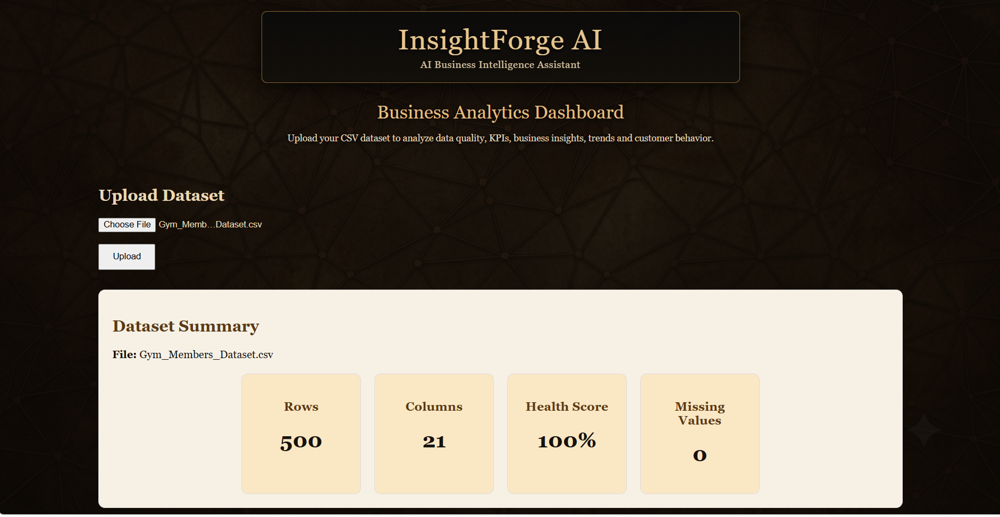
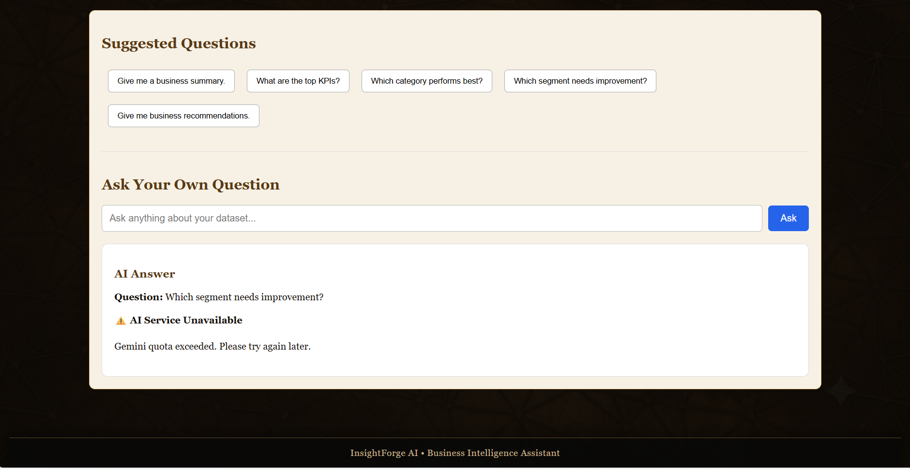

<div align="center">

# 🚀 InsightForge AI

### AI-Powered Business Intelligence Assistant

<p>
  <strong>Upload • Analyze • Visualize • Understand • Ask AI</strong>
</p>

<p>
  
</p>

<p>
  
  
  
  
  
  
</p>

<p>
  <a href="https://github.com/BhuvanaduraiMK">
    
  </a>
  <a href="https://www.linkedin.com/in/bhuvanadurai-m-1312a7248/">
    
  </a>
</p>

</div>

---

# 📌 About the Project

**InsightForge AI** is a full-stack **AI-powered Business Intelligence Assistant** that transforms raw CSV datasets into meaningful business insights.

Instead of manually performing repetitive data analysis, users can upload a dataset and automatically receive:

- 📊 Dataset profiling
- 🧹 Data cleaning
- 📈 KPI generation
- 💡 Business insights
- 📉 Correlation analysis
- 🔎 Outlier detection
- 📊 Data visualizations
- 📄 Automated PDF reports
- 🤖 AI-generated business questions
- 💬 Gemini-powered dataset Q&A

The goal of the project is to combine **Data Analytics + Backend Engineering + Generative AI** into one practical business intelligence platform.

---

# 🎯 Project Objective

Traditional data analysis often requires users to manually:

1. Inspect datasets
2. Clean missing values
3. Calculate statistics
4. Identify business KPIs
5. Analyze relationships
6. Detect outliers
7. Create visualizations
8. Prepare reports
9. Interpret the results

InsightForge AI automates these steps through a single web application.

### Simple workflow

```text
        CSV Dataset
             │
             ▼
      ┌──────────────┐
      │ Data Upload  │
      └──────┬───────┘
             │
             ▼
     ┌─────────────────┐
     │ Data Processing │
     └────────┬────────┘
              │
      ┌───────┼────────┐
      ▼       ▼        ▼
    KPIs   Insights  Quality
      │       │        │
      └───────┼────────┘
              ▼
      ┌─────────────────┐
      │ Statistical     │
      │ Analysis        │
      └────────┬────────┘
               │
        ┌──────┼───────┐
        ▼      ▼       ▼
     Charts  PDF     Context
                       │
                       ▼
                 ┌──────────┐
                 │ Gemini AI │
                 └────┬─────┘
                      │
                      ▼
                  AI Q&A


DASHBOARD INCLUDES
| Section               | Purpose                                  |
| --------------------- | ---------------------------------------- |
| 📤 Dataset Upload     | Upload CSV data                          |
| 📊 KPI Cards          | Display important dataset metrics        |
| 💡 Business Insights  | Automatically generated observations     |
| 📈 Visual Analysis    | Histograms, bar charts and box plots     |
| 📄 Business Report    | Generate downloadable PDF                |
| ❓ Suggested Questions | AI-generated business questions          |
| 🤖 AI Q&A             | Ask questions about the uploaded dataset |

✨ Key Features
📤 1. CSV Dataset Upload

Users can upload a CSV dataset directly through the web interface.

The backend processes the uploaded dataset and starts the analysis pipeline automatically.

🧹 2. Automated Data Cleaning

The system performs basic data cleaning operations including:

Duplicate row removal
Numeric missing-value handling
Categorical missing-value handling

This creates a cleaner dataset before analysis.

🔍 3. Dataset Profiling

InsightForge AI automatically identifies:

Number of records
Number of columns
Missing values
Duplicate rows
Numeric columns
Categorical columns
Column data types
Memory usage
Numeric statistics
Categorical statistics
Potential date columns
Dataset preview

📊 4. Automatic KPI Generation

The KPI engine dynamically analyzes numeric columns and generates:

Average
Minimum
Maximum
Median
Churn rate where applicable
Total records
Total columns
Missing values
Duplicate rows

The KPI system is designed to work with different datasets instead of depending entirely on a single business domain.

💡 5. Business Insights

The platform generates business-oriented insights from the uploaded dataset.

Examples include:

• Dataset contains 500 records.
• Average member age is 32.04 years.
• Average satisfaction score is 5.56.
• Members attend an average of 3.54 sessions per week.

The insight engine is being developed toward increasingly dataset-independent analysis so the same platform can be applied to different business datasets.

📈 6. Statistical Analysis

InsightForge AI performs automated statistical analysis including:

Correlation Analysis

Identifies meaningful relationships between numerical variables.

Example:

Weight_Start_kg ↔ BMI_Start
Correlation: 0.79
Outlier Detection

Uses the IQR (Interquartile Range) method to identify unusual numerical observations.

Distribution Analysis

Automatically generates histograms for selected numerical variables.

📊 Data Visualizations

The application automatically generates visualizations such as:

📊 Bar Charts

Used for categorical distributions.

Examples:

Gender Distribution
City Distribution
Membership Type Distribution
Goal Distribution

📈 Histograms

Used to understand numerical distributions.

Examples:

Age Distribution
Height Distribution
Weight Distribution
📦 Box Plots

Used for identifying potential outliers.

Examples:

Age Outlier Analysis
Height Outlier Analysis
Weight Outlier Analysis

📄 Automated Business Report

InsightForge AI generates a downloadable PDF business report.

The report can contain:

Executive Summary
Dataset Summary
Data Quality Information
Business Insights
KPI Table
Visual Analysis
Distribution Histograms
Categorical Analysis
Outlier Analysis

Example report structure:
INSIGHTFORGE AI
Business Analysis Report

EXECUTIVE SUMMARY

DATASET SUMMARY

BUSINESS INSIGHTS

KEY PERFORMANCE INDICATORS

VISUAL ANALYSIS

    Distribution Analysis
    Categorical Analysis
    Outlier Analysis

🤖 AI-Powered Business Q&A

One of the core features of InsightForge AI is the dataset-aware AI assistant.

The system builds a structured Business Dataset Context containing:

Dataset profile
Dataset columns
KPIs
Business insights
Numeric statistics
Categorical values
Category counts
Group averages
Churn analysis when applicable
Churn rates by category when applicable
Satisfaction analysis when applicable
Numeric correlations

This context is provided to Gemini so that questions can be answered using the analyzed dataset.

Example Questions
What is the average age?

Which category has the highest average value?

Which group has the highest churn rate?

What is the correlation between two variables?

Which category has the most records?

What business recommendations can be made?
-------------------------------------------------------------------------
The system is explicitly instructed to: Use the generated dataset context as the source of truth and avoid inventing values.


💬 AI Suggested Questions

After analyzing a dataset, Gemini can generate useful questions that users may want to ask.

For example:

Which category performs best?


What factors are associated with customer churn?


Which segment needs improvement?


What are the most important KPIs?


What business recommendations can be made?

The suggestions are generated from the available dataset information rather than from a fixed list of questions.

🏗️ System Architecture

┌───────────────────────────────────────┐
│            React Frontend             │
│                                       │
│  Upload • Dashboard • Q&A • Reports  │
└──────────────────┬────────────────────┘
                   │
                   ▼
┌───────────────────────────────────────┐
│            FastAPI Backend             │
└──────────────────┬────────────────────┘
                   │
          ┌────────┴─────────┐
          ▼                  ▼
┌─────────────────┐   ┌─────────────────┐
│ Data Processing │   │ Analysis Engine │
│                 │   │                 │
│ Pandas          │   │ KPIs            │
│ Cleaning        │   │ Insights        │
│ Profiling       │   │ Correlations    │
└─────────────────┘   │ Outliers        │
                      │ Visualizations  │
                      └────────┬────────┘
                               │
                    ┌──────────┴──────────┐
                    ▼                     ▼
             ┌──────────────┐      ┌─────────────┐
             │ PDF Reports  │      │ AI Context  │
             └──────────────┘      └──────┬──────┘
                                          │
                                          ▼
                                  ┌──────────────┐
                                  │ Google      │
                                  │ Gemini AI   │
                                  └──────────────┘
```
🛠️ Technology Stack
Frontend
<p>  </p>
React
Vite
JavaScript
CSS
Backend
<p>  </p>
Python
FastAPI
Uvicorn

Data Analytics
Pandas
NumPy
Statistical Analysis
IQR Outlier Detection
Correlation Analysis

Visualization & Reporting
Matplotlib
ReportLab

Generative AI
Google Gemini API
Dataset-aware prompting
AI-generated business questions
Context-based Q&A


Development Tools
<p>  </p>
Git
GitHub
Visual Studio Code

📁 Project Structure
AI-Business-Analysis/
│
├── backend/
│   ├── app/
│   │   ├── api/
│   │   │   └── upload.py
│   │   │
│   │   ├── services/
│   │   │   ├── cleaning.py
│   │   │   ├── profiling_service.py
│   │   │   ├── kpi_service.py
│   │   │   ├── insights_service.py
│   │   │   ├── correlation.py
│   │   │   ├── outlier.py
│   │   │   ├── dashboard_service.py
│   │   │   ├── context_service.py
│   │   │   └── ai_suggestion_service.py
│   │   │
│   │   └── main.py
│   │
│   ├── requirements.txt
│   └── .env.example
│
├── frontend/
│   ├── src/
│   │   ├── components/
│   │   ├── pages/
│   │   ├── assets/
│   │   ├── App.jsx
│   │   ├── main.jsx
│   │   └── index.css
│   │
│   ├── package.json
│   └── ...
│
├── .gitignore
├── README.md
└── LICENSE

⚙️ Installation & Setup
1. Clone the Repository
      git clone https://github.com/BhuvanaduraiMK/AI-Business-Analysis.git

      cd AI-Business-Analysis

🐍 Backend Setup

Navigate to the backend:
    cd backend

Create a virtual environment
    python -m venv .venv

Windows
    .venv\Scripts\activate

Install dependencies:
  pip install -r requirements.txt

🔐 Environment Variables

Create a .env file inside the backend directory.

    GEMINI_API_KEY=your_gemini_api_key

⚠️ Never commit your .env file or API key to GitHub.

Use .env.example as a reference. 

🚀 Start the Backend
    uvicorn app.main:app --reload

The FastAPI backend will be available locally.

⚛️ Frontend Setup

Open another terminal:

    cd frontend

Install dependencies:

    npm install

Start the development server:

    npm run dev

Open the local frontend URL shown by Vite.

Absolutely nanba. 👍

We'll do the final project cleanup + README/documentation + GitHub preparation without adding PostgreSQL or authentication.

Final cleanup plan
1. Backend cleanup

We'll check and clean:

services/ organization
duplicate logic
unused imports
unnecessary print() statements
inconsistent naming
error handling
comments/docstrings
API response structure
.env handling
Gemini API key protection
2. Frontend cleanup

We'll check:

unused components
unused CSS
consistent naming
responsive behavior
loading states
error states
upload flow
Q&A flow
report/PDF links
console warnings
3. Project structure

Target structure:

AI-Business-Analysis/
│
├── backend/
│   ├── app/
│   │   ├── api/
│   │   ├── services/
│   │   ├── utils/
│   │   ├── main.py
│   │   └── ...
│   │
│   ├── reports/
│   ├── requirements.txt
│   ├── .env.example
│   └── ...
│
├── frontend/
│   ├── src/
│   │   ├── components/
│   │   ├── pages/
│   │   ├── assets/
│   │   ├── App.jsx
│   │   ├── main.jsx
│   │   └── index.css
│   │
│   ├── package.json
│   └── ...
│
├── .gitignore
├── README.md
└── LICENSE

We don't need to force this exact structure if your existing project is already organized differently.

4. .gitignore

This is particularly important because you're using Gemini.

Your GitHub repository must not contain:

.env
.venv/
__pycache__/
node_modules/
*.pyc
reports/

A good root .gitignore will be:

# Python
__pycache__/
*.py[cod]
*.pyo


# Virtual environment
.venv/
venv/
env/


# Environment variables
.env
.env.*
!.env.example


# Node
node_modules/
frontend/node_modules/


# Build files
dist/
build/


# Generated reports
reports/
backend/reports/


# Generated charts / temporary files
*.png
*.jpg
*.jpeg
*.pdf


# IDE
.vscode/
.idea/


# OS
.DS_Store
Thumbs.db


# Logs
*.log

Don't commit your Gemini API key.

5. .env.example

Instead, put:

GEMINI_API_KEY=your_gemini_api_key_here

This lets another developer understand what environment variable is required without exposing your real key.

6. requirements.txt

Your backend should have a clean dependency list, for example:

fastapi
uvicorn
pandas
numpy
reportlab
matplotlib
python-multipart
python-dotenv
google-genai

But don't blindly replace your existing requirements file. We'll generate the final list from what your actual project imports.

7. README

Your README should sell the project as an actual AI Business Intelligence application, not just a CSV uploader.

I'd structure it like this:

# InsightForge AI
- IQR-based outlier detection
- Automatic visualizations
- PDF business reports
- AI-generated business questions
- Gemini-powered dataset Q&A
- Responsive React interface


## Architecture


React Frontend
        ↓
FastAPI Backend
        ↓
Pandas Data Processing
        ↓
Analysis Services
        ↓
Gemini AI
        ↓
Dashboard / PDF Report


## Technology Stack


### Frontend


- React
- Vite
- CSS


### Backend


- Python
- FastAPI
- Pandas
- NumPy
- ReportLab
- Matplotlib


### AI


- Google Gemini API


## Core Analysis


InsightForge AI automatically analyzes:


- Dataset size
- Missing values
- Duplicate records
- Numeric statistics
- Categorical distributions
- KPIs
- Correlations
- Outliers
- Business insights


## AI Q&A


Users can ask questions about the uploaded dataset.


The AI is instructed to answer using the generated dataset
context rather than inventing information.


## PDF Reports


The application generates business analysis reports containing:


- Executive summary
- Dataset summary
- Business insights
- KPI tables
- Distribution charts
- Categorical charts
- Outlier analysis


## Installation


### Backend


```bash
cd backend


python -m venv .venv

Windows:

.venv\Scripts\activate

Install dependencies:

pip install -r requirements.txt

Create .env:

GEMINI_API_KEY=your_api_key

Run the backend:

uvicorn app.main:app --reload
Frontend
cd frontend
npm install
npm run dev
Usage
Open the frontend.
Upload a CSV dataset.
Wait for analysis to complete.
Review KPIs and business insights.
Explore visualizations.
Download the generated PDF report.
Ask questions using the AI Q&A section.
Future Enhancements
User authentication
PostgreSQL persistence
Historical reports
Cloud deployment
Advanced predictive analytics
Role-based dashboards
Author

Bhuvanadurai M.

GitHub: BhuvanaduraiMK


We'll make the final README more polished once we've checked your actual project files.


---


# 8. GitHub preparation


Before pushing:


```bash
git status

Then check specifically:

git status --ignored

Make sure you do not see:

.env
.venv
node_modules
API keys
generated reports

Then:

git add .
git commit -m "Finalize InsightForge AI project"
git push

Since your GitHub repository already exists, we don't need to create another repository.

One important thing before we start

Because this is the final cleanup, I don't want to guess your current file structure and accidentally tell you to delete something your application needs.

Next step: show me your current project tree.

From:

D:\Project\AI-Business-Analysis

run:

tree /F

If the output is very large, use:

tree /F /A

and paste the result here.

Then we'll do the cleanup one file/folder at a time. After that I'll prepare the final README.md, .gitignore, .env.example, and GitHub commit checklist based on your actual project.

I think I am ready to move github can you generate more professional, intractive Readme file, include DASHBOARD or Dashboard Screenshot.
I didn't ignore Authentication Database connection files, If anyone check my project its look like ka optional part, so generate valid points in readme.

 I give example readme.file
<h1 align="center">Hi 👋, I'm Bhuvanadurai M</h1>

<h3 align="center">
AI & Data Engineering Enthusiast | Python Developer | FastAPI Learner
</h3>

<p align="center">

</p>

<p align="center">
<a href="https://www.linkedin.com/in/bhuvanadurai-m-1312a7248/">

</a>


</p>

---

# 👨‍💻 About Me

🎓 BE Computer Science & Engineering (Data Science)

💡 Passionate about Artificial Intelligence, Machine Learning, Backend Development and Data Analytics.

🚀 Currently building an **AI Business Analyst Platform** using FastAPI, PostgreSQL and AI.

🌱 Currently learning

- GEN AI
- Machine Learning
- Docker
- LangChain
- LLM Applications
- Production-ready Backend Development

🎯 Career Goal

Become an AI Engineer / Data Engineer by building real-world projects.

---

# 💻 Tech Stack

### Programming Languages

<p>

</p>

### Frameworks & Libraries

<p>

</p>

### Tools

<p>

</p>

### Data Analytics

- Power BI
- Excel
- Pandas
- NumPy
- Scikit-Learn
- PySpark
- SQL

---

# 🚀 Featured Projects

## 🤖 AI Business Analyst *(In Progress)*

AI-powered analytics platform that enables users to

- Upload CSV/Excel
- Clean data automatically
- Store data in PostgreSQL
- Generate KPIs
- Interactive Dashboard
- AI Question Answering
- Business Report Generation
- PDF Export

**Tech Stack**

FastAPI • PostgreSQL • Python • AI • Docker

---

## 📊 Social Media Sentiment Analysis

Machine Learning project using Twitter data.

- PySpark
- NLP
- Logistic Regression
- Naive Bayes
- Random Forest

---

## 📈 Power BI Dashboards

Interactive dashboards with

- DAX
- Power Query
- Data Modeling
- KPI Reporting

---

## 📑 Excel Data Analysis

Business dashboard creation using Microsoft Excel.

---

# 📈 GitHub Statistics

<p align="center">


</p>

---

# 🔥 GitHub Streak

<p align="center">


</p>

---

# 📊 Contribution Graph

<p align="center">


</p>

---

# 🏆 GitHub Trophies

<p align="center">


</p>

---

# 📚 Currently Learning

- Artificial Intelligence
- Machine Learning
- FastAPI
- PostgreSQL
- Docker
- LangChain
- LLM Applications
- System Design

---

# 💬 Quote

> *"Consistency beats intensity. Small improvements every day build exceptional software."*

---

<p align="center">

### ⭐ Thanks for visiting my profile! ⭐

Let's build something amazing with AI 🚀

</p>

this type of readme file i needed

Yes nanba — I understand exactly what you want. You want a professional GitHub README, similar to your personal profile README, but specifically for InsightForge AI, with a strong portfolio/project presentation and a dashboard screenshot section.

One important point: since PostgreSQL and authentication aren't currently part of the working implementation, I would not claim that they are implemented. Instead, we can show them under Future Enhancements / Planned Architecture. That makes the README look professional without misrepresenting your project.

Below is a ready-to-use README.md.

<div align="center">
  </a>
  <a href="https://www.linkedin.com/in/bhuvanadurai-m-1312a7248/">
    
  </a>
</p>


</div>


---


# 📌 About the Project


**InsightForge AI** is a full-stack **AI-powered Business Intelligence Assistant** that transforms raw CSV datasets into meaningful business insights.


Instead of manually performing repetitive data analysis, users can upload a dataset and automatically receive:


- 📊 Dataset profiling
- 🧹 Data cleaning
- 📈 KPI generation
- 💡 Business insights
- 📉 Correlation analysis
- 🔎 Outlier detection
- 📊 Data visualizations
- 📄 Automated PDF reports
- 🤖 AI-generated business questions
- 💬 Gemini-powered dataset Q&A


The goal of the project is to combine **Data Analytics + Backend Engineering + Generative AI** into one practical business intelligence platform.


---


# 🎯 Project Objective


Traditional data analysis often requires users to manually:


1. Inspect datasets
2. Clean missing values
3. Calculate statistics
4. Identify business KPIs
5. Analyze relationships
6. Detect outliers
7. Create visualizations
8. Prepare reports
9. Interpret the results


InsightForge AI automates these steps through a single web application.


### Simple workflow


```text
        CSV Dataset
             │
             ▼
      ┌──────────────┐
      │ Data Upload  │
      └──────┬───────┘
             │
             ▼
     ┌─────────────────┐
     │ Data Processing │
     └────────┬────────┘
              │
      ┌───────┼────────┐
      ▼       ▼        ▼
    KPIs   Insights  Quality
      │       │        │
      └───────┼────────┘
              ▼
      ┌─────────────────┐
      │ Statistical     │
      │ Analysis        │
      └────────┬────────┘
               │
        ┌──────┼───────┐
        ▼      ▼       ▼
     Charts  PDF     Context
                       │
                       ▼
                 ┌──────────┐
                 │ Gemini AI │
                 └────┬─────┘
                      │
                      ▼
                  AI Q&A
🖥️ Dashboard

The application provides an interactive dashboard where users can upload a CSV dataset and explore automatically generated business analysis.

Dashboard Preview

📌 Add your actual dashboard screenshot here

frontend/src/assets/dashboard-screenshot.png

Then use:

<p align="center">
  
</p>
Dashboard includes
Section	Purpose
📤 Dataset Upload	Upload CSV data
📊 KPI Cards	Display important dataset metrics
💡 Business Insights	Automatically generated observations
📈 Visual Analysis	Histograms, bar charts and box plots
📄 Business Report	Generate downloadable PDF
❓ Suggested Questions	AI-generated business questions
🤖 AI Q&A	Ask questions about the uploaded dataset
✨ Key Features
📤 1. CSV Dataset Upload

Users can upload a CSV dataset directly through the web interface.

The backend processes the uploaded dataset and starts the analysis pipeline automatically.

🧹 2. Automated Data Cleaning

The system performs basic data cleaning operations including:

Duplicate row removal
Numeric missing-value handling
Categorical missing-value handling

This creates a cleaner dataset before analysis.

🔍 3. Dataset Profiling

InsightForge AI automatically identifies:

Number of records
Number of columns
Missing values
Duplicate rows
Numeric columns
Categorical columns
Column data types
Memory usage
Numeric statistics
Categorical statistics
Potential date columns
Dataset preview
📊 4. Automatic KPI Generation

The KPI engine dynamically analyzes numeric columns and generates:

Average
Minimum
Maximum
Median
Churn rate where applicable
Total records
Total columns
Missing values
Duplicate rows

The KPI system is designed to work with different datasets instead of depending entirely on a single business domain.

💡 5. Business Insights

The platform generates business-oriented insights from the uploaded dataset.

Examples include:

• Dataset contains 500 records.
• Average member age is 32.04 years.
• Average satisfaction score is 5.56.
• Members attend an average of 3.54 sessions per week.

The insight engine is being developed toward increasingly dataset-independent analysis so the same platform can be applied to different business datasets.

📈 6. Statistical Analysis

InsightForge AI performs automated statistical analysis including:

Correlation Analysis

Identifies meaningful relationships between numerical variables.

Example:

Weight_Start_kg ↔ BMI_Start
Correlation: 0.79
Outlier Detection

Uses the IQR (Interquartile Range) method to identify unusual numerical observations.

Distribution Analysis

Automatically generates histograms for selected numerical variables.

📊 Data Visualizations

The application automatically generates visualizations such as:

📊 Bar Charts

Used for categorical distributions.

Examples:

Gender Distribution
City Distribution
Membership Type Distribution
Goal Distribution
📈 Histograms

Used to understand numerical distributions.

Examples:

Age Distribution
Height Distribution
Weight Distribution
📦 Box Plots

Used for identifying potential outliers.

Examples:

Age Outlier Analysis
Height Outlier Analysis
Weight Outlier Analysis
📄 Automated Business Report

InsightForge AI generates a downloadable PDF business report.

The report can contain:

Executive Summary
Dataset Summary
Data Quality Information
Business Insights
KPI Table
Visual Analysis
Distribution Histograms
Categorical Analysis
Outlier Analysis

Example report structure:

INSIGHTFORGE AI
Business Analysis Report


EXECUTIVE SUMMARY


DATASET SUMMARY


BUSINESS INSIGHTS


KEY PERFORMANCE INDICATORS


VISUAL ANALYSIS


    Distribution Analysis
    Categorical Analysis
    Outlier Analysis
🤖 AI-Powered Business Q&A

One of the core features of InsightForge AI is the dataset-aware AI assistant.

The system builds a structured Business Dataset Context containing:

Dataset profile
Dataset columns
KPIs
Business insights
Numeric statistics
Categorical values
Category counts
Group averages
Churn analysis when applicable
Churn rates by category when applicable
Satisfaction analysis when applicable
Numeric correlations

This context is provided to Gemini so that questions can be answered using the analyzed dataset.

Example Questions
What is the average age?


Which category has the highest average value?


Which group has the highest churn rate?


What is the correlation between two variables?


Which category has the most records?


What business recommendations can be made?

The system is explicitly instructed to:

Use the generated dataset context as the source of truth and avoid inventing values.

💬 AI Suggested Questions

After analyzing a dataset, Gemini can generate useful questions that users may want to ask.

For example:

Which category performs best?


What factors are associated with customer churn?


Which segment needs improvement?


What are the most important KPIs?


What business recommendations can be made?

The suggestions are generated from the available dataset information rather than from a fixed list of questions.

🏗️ System Architecture
┌───────────────────────────────────────┐
│            React Frontend             │
│                                       │
│  Upload • Dashboard • Q&A • Reports  │
└──────────────────┬────────────────────┘
                   │
                   ▼
┌───────────────────────────────────────┐
│            FastAPI Backend             │
└──────────────────┬────────────────────┘
                   │
          ┌────────┴─────────┐
          ▼                  ▼
┌─────────────────┐   ┌─────────────────┐
│ Data Processing │   │ Analysis Engine │
│                 │   │                 │
│ Pandas          │   │ KPIs            │
│ Cleaning        │   │ Insights        │
│ Profiling       │   │ Correlations    │
└─────────────────┘   │ Outliers        │
                      │ Visualizations  │
                      └────────┬────────┘
                               │
                    ┌──────────┴──────────┐
                    ▼                     ▼
             ┌──────────────┐      ┌─────────────┐
             │ PDF Reports  │      │ AI Context  │
             └──────────────┘      └──────┬──────┘
                                          │
                                          ▼
                                  ┌──────────────┐
                                  │ Google      │
                                  │ Gemini AI   │
                                  └──────────────┘
🛠️ Technology Stack
Frontend
<p>  </p>
React
Vite
JavaScript
CSS
Backend
<p>  </p>
Python
FastAPI
Uvicorn
Data Analytics
Pandas
NumPy
Statistical Analysis
IQR Outlier Detection
Correlation Analysis
Visualization & Reporting
Matplotlib
ReportLab
Generative AI
Google Gemini API
Dataset-aware prompting
AI-generated business questions
Context-based Q&A
```
Development Tools
<p>  </p>
Git
GitHub
Visual Studio Code

```
📁 Project Structure
AI-Business-Analysis/
│
├── backend/
│   ├── app/
│   │   ├── api/
│   │   │   └── upload.py
│   │   │
│   │   ├── services/
│   │   │   ├── cleaning.py
│   │   │   ├── profiling_service.py
│   │   │   ├── kpi_service.py
│   │   │   ├── insights_service.py
│   │   │   ├── correlation.py
│   │   │   ├── outlier.py
│   │   │   ├── dashboard_service.py
│   │   │   ├── context_service.py
│   │   │   └── ai_suggestion_service.py
│   │   │
│   │   └── main.py
│   │
│   ├── requirements.txt
│   └── .env.example
│
├── frontend/
│   ├── src/
│   │   ├── components/
│   │   ├── pages/
│   │   ├── assets/
│   │   ├── App.jsx
│   │   ├── main.jsx
│   │   └── index.css
│   │
│   ├── package.json
│   └── ...
│
├── .gitignore
├── README.md
└── LICENSE

The exact structure may vary slightly depending on the current project version.

⚙️ Installation & Setup
1. Clone the Repository
git clone https://github.com/BhuvanaduraiMK/AI-Business-Analysis.git


cd AI-Business-Analysis
🐍 Backend Setup

Navigate to the backend:

cd backend

Create a virtual environment:

python -m venv .venv
Windows
.venv\Scripts\activate

Install dependencies:

pip install -r requirements.txt
🔐 Environment Variables

Create a .env file inside the backend directory.

GEMINI_API_KEY=your_gemini_api_key

⚠️ Never commit your .env file or API key to GitHub.

Use .env.example as a reference.

🚀 Start the Backend
uvicorn app.main:app --reload

The FastAPI backend will be available locally.

⚛️ Frontend Setup

Open another terminal:

cd frontend

Install dependencies:

npm install

Start the development server:

npm run dev

Open the local frontend URL shown by Vite.

🔄 Application Workflow
1. Upload CSV
      ↓
2. Validate Dataset
      ↓
3. Clean Dataset
      ↓
4. Profile Dataset
      ↓
5. Calculate KPIs
      ↓
6. Generate Business Insights
      ↓
7. Analyze Correlations
      ↓
8. Detect Outliers
      ↓
9. Generate Charts
      ↓
10. Generate PDF Report
      ↓
11. Build AI Dataset Context
      ↓
12. Generate AI Questions
      ↓
13. Ask Questions
      ↓
14. Gemini Generates Dataset-Based Answer

🧪 Testing

The application should be tested with datasets from different domains.

Recommended test cases:

✓ Fitness / Gym Dataset
✓ Sales Dataset
✓ Customer Dataset
✓ Student Dataset
✓ General Business Dataset

The goal is to ensure that the analysis pipeline works beyond a single dataset type.


🔐 Authentication & Database — Future Architecture

Authentication and PostgreSQL are not required for the current core analysis workflow.

They are planned as future enhancements for turning InsightForge AI into a multi-user production platform.

Planned architecture
User
 │
 ▼
Authentication
 │
 ▼
FastAPI
 │
 ├── PostgreSQL
 │      ├── Users
 │      ├── Datasets
 │      ├── Reports
 │      └── Analysis History
 │
 └── AI Analysis Engine

Potential future capabilities:

User accounts
Secure authentication
Dataset history
Saved reports
Analysis history
User-specific dashboards
PostgreSQL persistence
Role-based access

This keeps the current project focused while providing a clear path toward production deployment.

🚀 Future Enhancements
🔐 User Authentication
🗄️ PostgreSQL Database Integration
📚 Dataset History
📄 Saved Report Management
☁️ Cloud Deployment
🐳 Docker Containerization
📊 Advanced Interactive Charts
🔮 Predictive Analytics
🤖 Machine Learning Models
👥 Role-Based Dashboards
📈 Automated Business Forecasting

📚 What I Learned

Through this project, I worked with:

Full-stack application development
FastAPI REST APIs
React frontend development
Pandas data processing
Automated data profiling
Statistical analysis
KPI engineering
Data visualization
PDF report generation
Generative AI integration
Prompt engineering
Dataset-aware AI systems
Git & GitHub
Environment variable management
Backend/frontend integration

🎯 Project Highlights
📊 Automated Analysis

Transforms raw CSV data into structured business analysis.

🤖 AI Integration

Uses Gemini to provide dataset-aware business Q&A.

🧠 Dynamic Context Generation

Builds a detailed analytical context before sending questions to the AI.

📄 Automated Reporting

Generates professional PDF business reports.

🔎 Statistical Intelligence

Includes correlation and IQR-based outlier analysis.

🌐 Full-Stack Architecture

Combines a React frontend with a FastAPI backend.
```
📸 Screenshots
Dashboard
<p align="center">  </p>
AI Q&A
<p align="center">  </p>
Business Report
<p align="center">  </p>

Add these screenshots to the repository before publishing the README.

👨‍💻 About the Developer
Bhuvanadurai M

🎓 Computer Science & Engineering — Data Science

💡 Interested in:

Artificial Intelligence
Data Science
Data Engineering
Backend Development
Generative AI
Machine Learning

🚀 Building practical AI and data-driven applications.

🎯 Career Goal:

AI Engineer / Data Engineer

🔗 Connect With Me
<p align="center"> <a href="https://github.com/BhuvanaduraiMK">  </a> <a href="https://www.linkedin.com/in/bhuvanadurai-m-1312a7248/">  </a> </p>

⭐ Support

If you find this project useful or interesting, consider giving it a ⭐ on GitHub.

<div align="center">
🚀 Turning Data Into Decisions With AI

InsightForge AI

</div> ```

